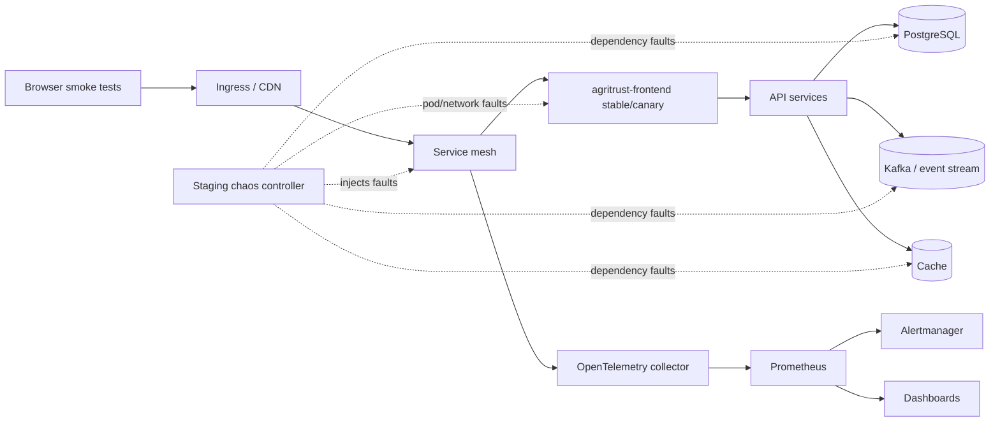

# Chaos Engineering Testing Blueprint for Staging

## Purpose and scope

This blueprint defines the staging-only chaos engineering program for the AgriTrust frontend and the platform services it depends on. The scope is system-wide: browser delivery, API ingress, wallet transaction paths, PostgreSQL-backed reads, Kafka/event streaming, cache, observability, and deployment automation.

Chaos tests must never run against production by default. Every experiment requires an approved staging change window, a named incident commander, a rollback owner, and confirmation that synthetic accounts, test wallets, and redacted telemetry are being used.

## Objectives and non-negotiable bounds

| Bound | Requirement | Enforcement |
| --- | --- | --- |
| Critical-path latency | Keep P99 below 100 ms for authentication, title lookup, certification verification, and wallet preflight paths during steady state and recovery. | Prometheus latency alerts, canary analysis, and experiment pass/fail gates. |
| Availability | Preserve 99.99% staging uptime for externally reachable smoke endpoints during planned experiments. | Blackbox probes and service-mesh success-rate alerts. |
| Security | All new experiment manifests, RBAC, network policies, and telemetry labels must pass security review before scheduling. | Security checklist in the runbook and pull-request review. |
| Blast radius | Run one failure mode at a time, one namespace at a time, with explicit duration and abort conditions. | Chaos manifest annotations and manual preflight approval. |
| Recovery | Roll back to a healthy blue or green track within the documented recovery window. | Blue-green deployment checks and canary halt policy. |

## Reference architecture

The chaos controller injects only approved failures into the staging namespace. Traffic enters through the same ingress and service-mesh policies used by blue-green and canary releases so experiments test realistic routing, telemetry, and rollback behavior.

## Experiment catalogue

| ID | Failure mode | Target | Hypothesis | Steady-state signal | Abort condition |
| --- | --- | --- | --- | --- | --- |
| `frontend-pod-restart` | Kill one frontend pod. | Canary track first, then inactive colour. | Kubernetes readiness and service mesh remove the pod before user impact. | P99 < 100 ms, 5xx < 1%, available replicas >= 1. | No ready canary pod for 2 minutes or page alert fires. |
| `frontend-network-latency` | Add 75 ms ingress-to-frontend latency for 5 minutes. | Staging frontend service. | Critical paths remain under the 100 ms P99 budget after retries and cache hits. | P99 < 100 ms for critical routes. | P99 >= 100 ms for 5 minutes or synthetic checkout fails twice. |
| `api-5xx-burst` | Inject 2% upstream 5xx for 10 minutes. | API routes called by frontend. | UI retries, error boundaries, and status banners avoid cascading failures. | Frontend 5xx < 1%, successful recovery after fault removal. | Frontend error rate >= 2% for 5 minutes. |
| `postgres-read-delay` | Add 50 ms delay to read-only database calls. | API database dependency in staging. | Cache and query deadlines protect user-facing critical paths. | Title lookup and verification P99 < 100 ms. | Database pool saturation or P99 budget breach. |
| `kafka-consumer-pause` | Pause a staging consumer group for 5 minutes. | Event-stream delivery. | UI displays stale state safely and recovers when consumers resume. | Lag alert remains warning-only and no duplicate user actions occur. | Lag remains elevated 10 minutes after resume. |
| `cache-eviction` | Flush staging cache keys for public read models. | Cache layer. | Cold starts do not break availability or security controls. | Availability >= 99.99%, no sensitive cache labels emitted. | Authentication, signing, or verification smoke tests fail. |
| `otel-collector-drop` | Drop telemetry export traffic for 5 minutes. | Observability path only. | Application requests continue while bounded spans are dropped. | No user-facing errors, telemetry backlog remains bounded. | Memory growth or user route failures. |

## Implementation plan

1. **Design and review**: approve this blueprint, the staging experiment manifest, RBAC boundaries, and rollback owners with platform and security reviewers.
2. **Core logic**: store experiment metadata in `deploy/chaos/staging-experiments.yaml`; validate it with `npm run test:chaos-blueprint` before merge.
3. **Monitoring**: add dashboard panels for latency, availability, error rate, traffic split, ready pods, and experiment annotations. Page on SLO breach and notify the release channel for warning-only signals.
4. **Deployment**: run experiments against the inactive blue/green colour first, then a 5% canary. Halt promotion automatically if latency, availability, or error budgets breach.
5. **Documentation**: keep the operator runbook in `docs/runbooks/chaos-engineering-staging.md` and update it after every game day.

## Pass/fail criteria

An experiment passes only when all of the following are true:

- The declared hypothesis is met without exceeding the 100 ms P99 critical-path latency target.
- Availability remains at or above 99.99% for the active staging smoke endpoint window.
- Alerts fire at the intended severity and link to a current runbook.
- The system recovers to baseline within the expected recovery window after the fault is removed.
- Security review confirms no secrets, wallet addresses, farm identifiers, account IDs, or transaction payloads were exposed in manifests, logs, metrics, traces, dashboards, or alert labels.

## Review cadence

Run a small experiment weekly and a system-wide staging game day monthly. Re-baseline hypotheses after architecture changes, dependency upgrades, SLO changes, or incident postmortems.
